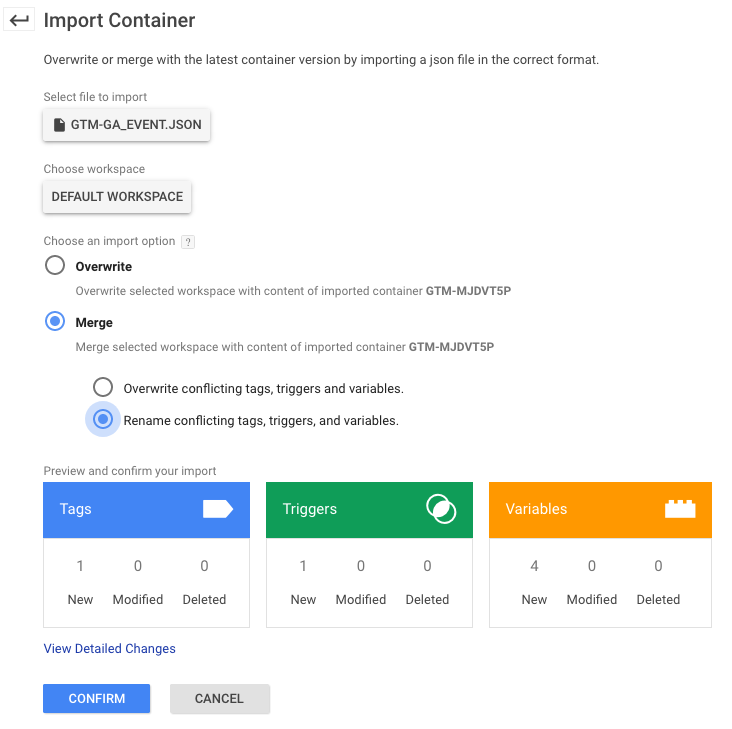

# GTM Generic GA Event Container
Implement Simo Ahava's [Generic GA Event](https://www.simoahava.com/analytics/create-a-generic-event-tag/) for Google Tag Manager.

## Purpose
You can reduce the redundancy in your containers by using a generic GA event. Unfortunately, it takes a fair amount of clicking around to create the user variables, trigger, and tag required to implement a generic Google Analytics event.

## Requirements
This is only useful if you are running Google Tag Manager and Universal Analytics.

## Installation
1. Open your GTM container

1. ADMIN > Import Container

1. Import the JSON file into your current workspace using the "Merge" option.

  

## License
[Apache V2](http://www.apache.org/licenses/)
