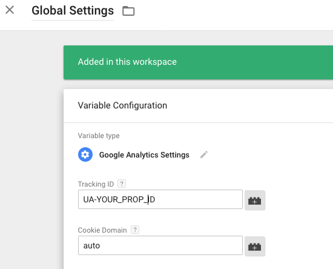

# GTM Generic GA Event Container
A Google Tag Manager container you can import to implement Simo Ahava's [Generic GA Event](https://www.simoahava.com/analytics/create-a-generic-event-tag/).

## Purpose
You can reduce the redundancy in your containers by using a generic Google Analytics GTM event. Unfortunately, it takes a fair amount of clicking around to create the user variables, trigger, and tag required to implement a generic Google Analytics event.

Just download the JSON file from this repo and import it into your Google Tag Manager container.

## Requirements
This is only useful if you are running Google Tag Manager and Universal Analytics.

## Installation
1. Open your GTM container

1. ADMIN > Import Container
  
1. Import the JSON file into your current workspace using the "Merge" option.  
  
  
1. Edit the Global Settings variable and set your Google Analytics Property ID.  
  

Alternatively, you could set your ID in the "GA Event" just tag just imported..

## License
[Apache V2](http://www.apache.org/licenses/)
